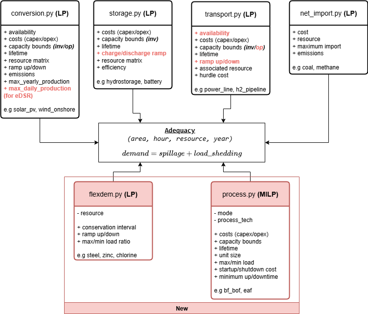

# POMMES-KUL - Planning and Operation Model for Multi-Energy Systems (ESIM-KUL version)

[POMMES](https://git.persee.minesparis.psl.eu/energy-alternatives/pommes) is an open source framework to model investment pathways in multi-energy systems.
The framework enables to minimise the system costs to meet the energy services demand by modelling the investment
and operating costs of energy conversion, storage and transport technologies.

POMMES-KUL integrates a selection of POMMES modules (pulled from [version 0.2.3](https://git.persee.minesparis.psl.eu/energy-alternatives/pommes/-/tree/5df6a4683cb1767fa7a17284c5afe3abf35abf33) in July 2025)—some of which have been adapted—alongside two new modules (one explicitly using MILP).




## Installation

### Prerequisites

- Install [Miniconda3 distribution](https://docs.conda.io/en/latest/miniconda.html)

Choose the installation depending on your platform.

To integrate conda in PowerShell, run in the `Anaconda Prompt`:
- On Windows
    ```bash
    $ conda init powershell
    ```

- On Linux
    ```bash
    $ conda init bash
    ```

### Python environment creation
Ensure Conda is initiated in your shell: see [prerequisites](#prerequisites) if needed.

Use the [`ci/envs/environment.yaml`](ci/envs/environment.yaml) file from this
repository.

To create the environment, run from the repository root:

```bash
$ conda env create -f ci/envs/environment.yaml
```
